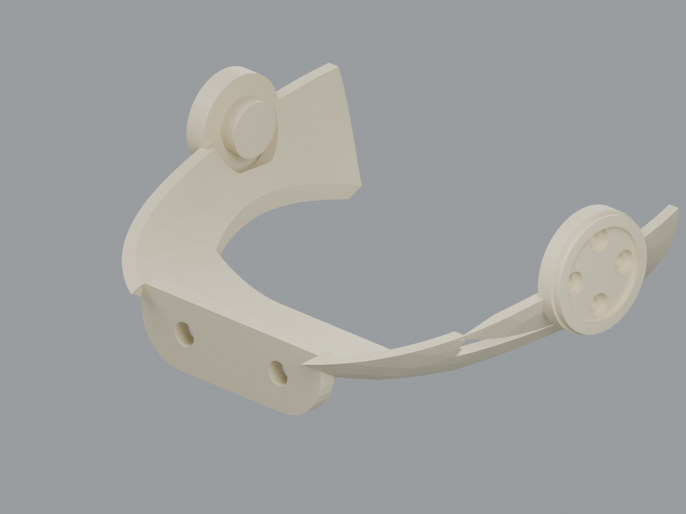
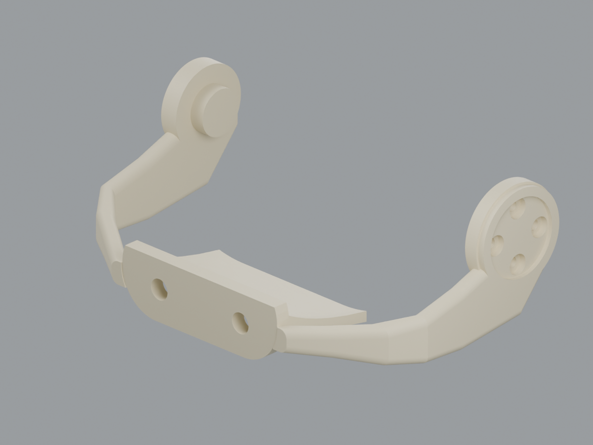

MicroDak 외형을 3D 프린터로 출력한 뒤, 아직 도착하지 않은 실제 모터를 대신해 **더미 모터를 출력하여 가조립을 시도했습니다.** 이 과정에서 모터가 들어갈 공간과 나사 구멍이 모터 규격에 맞지 않아 일부 부품을 조립할 수 없다는 문제를 발견했습니다. 현재는 STL 설계를 보완하며 수정본의 재출력과 맞춤 확인을 이어가는 단계입니다.

소프트웨어 쪽에서는 **Radxa 설정, 프로그램 빌드와 실행, MuJoCo 연동 구동까지 완료**했습니다. 2026년 10월 1일 기준으로 기구 보완과 실물 통합 준비를 병행하고 있습니다.

## 현재 진행 상황

| 항목 | 현재 상태 |
| --- | --- |
| 외형 출력 | 출력 후 더미 모터 가조립 시도 |
| 모터 장착부와 결합부 | 치수 불일치·간섭 확인 후 STL 보완 중 |
| 실제 XL330 모터 | 배송 대기, 실모터 조립·구동 시험 대기 |
| Radxa 설정과 프로그램 | 설정·빌드·실행 완료 |
| MuJoCo 연동 | Radxa 프로그램과 연결하여 구동 완료 |
| HAT 보드 | 기존 3장 제작 발주 완료, 배송 대기 |
| 실물 센서와 로봇 통합 | IMU 장착·통신, 모터 연결, 통합 시험 예정 |

## 더미 모터 가조립에서 발견한 문제

실제 모터가 오기 전에 구조를 확인하기 위해 XL330 공식 CAD를 바탕으로 만든 더미 모터를 사용했습니다. 모터 뒤쪽에서 축을 지지하는 **아이들러**와 회전력을 전달하는 **혼** 주변에서 특히 큰 차이가 드러났습니다.

최신 출력 STL을 공식 모터 CAD 및 MicroDuck 원본과 대조한 설계 점검 기록에서는, 아이들러 외경을 작게 가정하고 혼의 나사 배치도 다르게 적용한 것이 확인됐습니다. 이는 단순히 출력 수축을 조정하는 것으로 해결하기 어려운 설계 치수 문제였습니다.

| 점검 항목 | 발견한 문제 | 반영한 수정 |
| --- | --- | --- |
| 혼 나사 배치 | 나사 중심을 잇는 원의 지름을 Ø9mm로 적용 | PCD Ø12mm로 보정 |
| 아이들러 공간 | Ø16mm 아이들러에 비해 수용 공간이 작음 | 수용 공간 Ø16.6mm로 보정 |
| 발목과 종아리 | 베어링 지지와 브래킷 결합 위치 문제 | 베어링 받침 추가, 결합 위치 보정 |
| 무릎과 목 | 절삭 형상이 혼 나사 자리를 침범 | 나사 결합부를 유지하도록 형상 수정 |
| 머리 하부와 턱 | 모터·베어링과 구조물 간섭 | 관련 내부 형상 보완 |

이 모터 장착부 수정에서는 **STL 16개를 교체**했습니다. 설계상의 15개 관절 나사 정렬과 모터 간섭 검사를 통과했으며, 관절축과 발바닥 위치는 유지했습니다. 실제 출력물의 끼움과 조립 공차는 수정본을 출력해 다시 확인해야 합니다.

## 출력성과 결합 구조도 함께 보완

모터 장착 치수 외에도 출력하고 조립하는 과정에서 드러난 약한 연결부와 결합부를 추가 수정했습니다.

- **목 연결부:** 쉽게 부러질 수 있는 양쪽 얇은 연결부를 넓히고 보강했습니다. 몸통의 목 통과부도 함께 조정했습니다.
- **위아래 부리:** 끝부분만 살짝 걸리던 구조를 넓은 받침면과 핀·구멍 결합으로 바꿨습니다. 핀으로 위치를 잡고 넓은 면에 접착하는 방식입니다.
- **턱 옆벽:** 계단처럼 남은 얇은 조각을 없애고, 회전축부터 부리 받침까지 이어지는 둥근 지지벽으로 바꿨습니다.
- **허벅지 커버:** 모터 구멍이나 배선 창과 겹치던 고정점을 피하도록 본체 구멍과 커버 핀을 함께 옮겼습니다. 커버는 안쪽 베어링 플레이트가 아니라 허벅지 본체에 결합합니다.

<figure><figcaption>수정 전 · 얇은 조각과 계단이 남은 턱 옆벽</figcaption></figure>
<figure><figcaption>수정 후 · 둥글고 연속된 지지벽으로 보완</figcaption></figure>

*위 이미지는 설계 렌더링입니다. 수정된 출력물의 실물 사진은 아닙니다.*

최근 추가 개정 파일은 다음과 같습니다. 여러 차례 수정한 파일이 있어 각 개정의 파일 수를 단순 합산하면 안 됩니다.

| 추가 개정 | 변경 파일 |
| --- | --- |
| 목과 부리 결합부 | <code>neck_tray.stl</code>, <code>shell_upper.stl</code>, <code>jaw.stl</code>, <code>skull_lower.stl</code>, <code>beak_lower.stl</code>, <code>beak_upper.stl</code> |
| 턱 옆벽 | <code>jaw.stl</code> 추가 보완 |
| 허벅지 커버 고정점 | <code>thigh_L.stl</code>, <code>thigh_R.stl</code>, <code>thigh_cover_L.stl</code>, <code>thigh_cover_R.stl</code> |

허벅지는 **본체와 커버를 한 쌍으로 재출력**해야 합니다. 안쪽 베어링 플레이트인 <code>thigh_plate_L/R.stl</code>은 이번 커버 고정점 수정에서 변경하지 않았습니다. 커버 핀은 위치를 맞추는 용도이며 스냅 잠금 구조는 아닙니다.

각 수정 범위의 설계 검사는 진행했지만, 전체 실물 조립은 아직 완료하지 않았습니다. 기존 별도 검토 항목인 전장 보드와 머리 외피의 간섭 등도 남아 있어, 수정된 부품부터 가조립으로 확인하고 있습니다.

## Radxa 설정과 MuJoCo 연동 구동 완료

Radxa의 설정을 마치고 프로그램을 빌드하여 실행했습니다. 이어서 MuJoCo와 연동한 상태에서 구동까지 완료했습니다.



[실행 화면 원본 확대하기](radxa-mujoco.png)

첨부 화면에는 MicroDak LIVE의 연결 상태, 정책 선택과 조작 기능, 관절 상태를 표시하는 모니터, MuJoCo 속 로봇이 함께 나타납니다. 이번 완료 범위는 **Radxa에서 실행되는 프로그램과 시뮬레이터의 연동**입니다. 실제 모터가 아직 도착하지 않아 실물 모터 구동과 로봇 보행 시험은 다음 단계로 남아 있습니다.

## 다음 작업

1. 수정한 STL을 재출력하고 더미 모터로 장착·결합 상태를 다시 확인합니다.
2. 실제 모터와 HAT가 도착하면 수량·외관을 확인하고 실물 조립 공차를 점검합니다.
3. IMU 장착·통신과 모터 단품 시험을 거쳐 전체 로봇의 통합 구동을 확인합니다.

HAT는 **3장, 배송비 포함 총 681,495원**으로 발주한 상태를 유지합니다. 이번 진행 기록에는 추가 비용을 반영하지 않았습니다.

[MicroDak 작업실에서 전체 진행 현황 보기](/microdak/) · [이전 부품 입고와 발주 기록](/posts/microdak-progress-20260929/)
